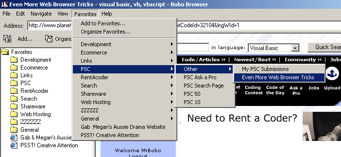



## Even More Web Browser Tricks

### Description

Here is the third part of my Web Browser Tricks

This time as a Web Browser(nearly). What's here ? - a nearly exact clone of Internet Explorer's Favorites menu, autocomplete Address combo, menu's enabled/disabled by the Webbrowser, text resizing including identification of current size, progress bar in the Statusbar, plus all the standard WebBrowser stuff.
 
### More Info
 

             |
---                |---
**Submitted On**   |2002-05-29 04:09:14
**By**             |[MrBobo](https://github.com/Planet-Source-Code/PSCIndex/blob/master/ByAuthor/mrbobo.md)
**Level**          |Intermediate
**User Rating**    |5.0 (45 globes from 9 users)
**Compatibility**  |VB 6\.0
**Category**       |[Internet/ HTML](https://github.com/Planet-Source-Code/PSCIndex/blob/master/ByCategory/internet-html__1-34.md)
**World**          |[Visual Basic](https://github.com/Planet-Source-Code/PSCIndex/blob/master/ByWorld/visual-basic.md)
**Archive File**   |[Even\_More\_878275282002\.zip](https://github.com/Planet-Source-Code/mrbobo-even-more-web-browser-tricks__1-32104/archive/master.zip)

